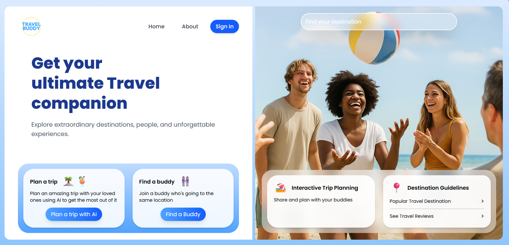
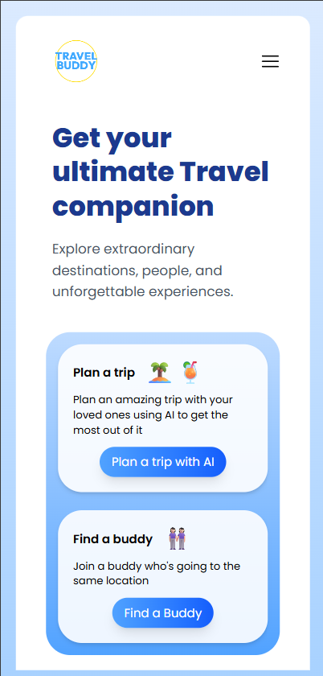

# 🌍 Travel Buddy

Travel Buddy is your ultimate travel planning companion, helping users discover destinations, plan trips, and even find travel buddies — all through a beautifully animated and responsive React frontend.

## 🚀 Features Implemented

### ✅ Landing Page (Home)
- Responsive layout using **Tailwind CSS**
- Split screen with:
  - 📄 Left section: Tagline, introduction, and CTA cards (`Plan a Trip` & `Find a Buddy`)
  - 🖼️ Right section: Background image with a search bar and travel tips
- Mobile navigation menu using **hamburger toggle**
- Cards with gradients, shadows, and animated hover effects
- Google Maps Autocomplete setup (deprecated, moving to manual input-based search)
- Routing integrated using **React Router DOM**

### 🧭 Navigation
- `Home`, `About`, and `Sign In` routes
- Hamburger menu for smaller screens
- Button links to `/TripPlaner` and other pages (future-ready)

## 🧩 Stack

- ⚛️ **React**
- 🎨 **Tailwind CSS**
- 🔄 **React Router DOM**
- 🗺️ Google Maps API (Search planned, Autocomplete deprecated)
- 🧠 AI Trip Planning (planned)
- 🔍 Place Search (planned using Google Places or alternative)

## 🧪 In Progress / Coming Soon

- AI-powered itinerary planning page (`/TripPlaner`)
- Google Places API integration for:
  - Location-based search
  - Hotels, restaurants, and activities
- Trip buddy matching system
- User authentication system
- Backend integration (Node/Express or Firebase)

## 📸 Screenshots (Optional)

| Desktop View | Mobile View |
|--------------|-------------|
|  |  |

