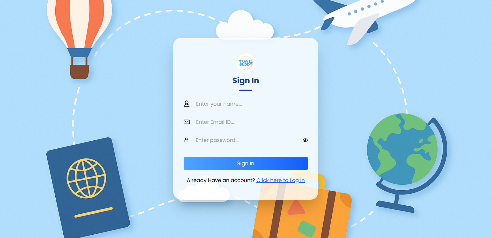
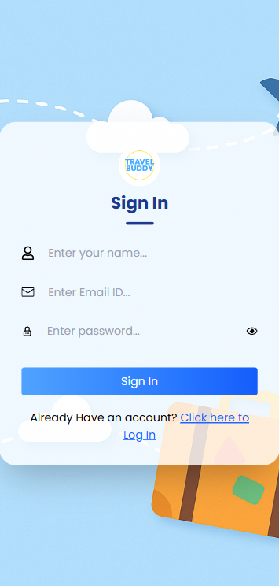
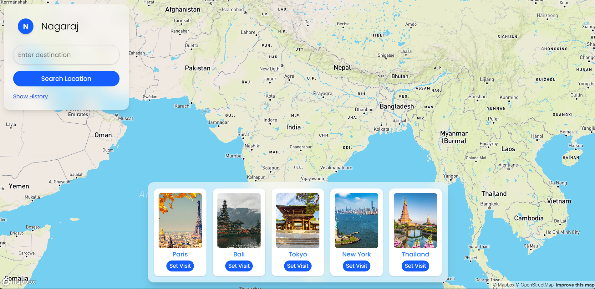
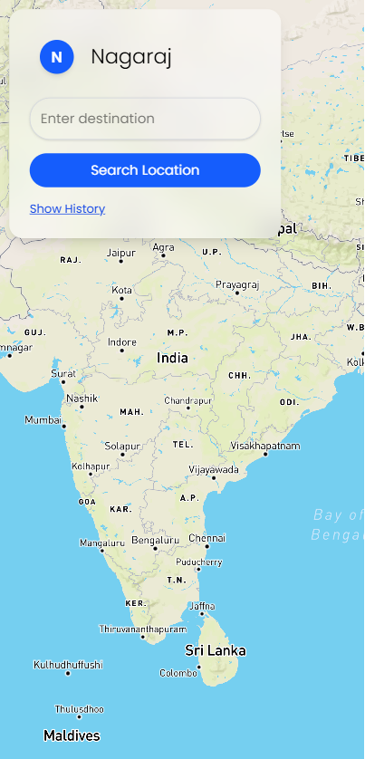

# 🌍 Travel Buddy

**Travel Buddy** is a full-stack travel application designed to make trip planning seamless and social. Users can generate AI-based itineraries, find like-minded travel partners, share their destinations in real-time, and explore curated travel experiences.

---

## ✨ Features

- 🔒 Secure User Authentication (JWT + bcrypt)
- 📍 Real-time destination sharing using **Socket.IO** and **Mapbox**
- 🤖 AI-powered trip planning (future integration scope)
- 🧳 View past search history and re-plan trips easily
- 👥 Connect with other travelers through shared destinations
- 💡 Interactive and responsive design with smooth animations
- 🎯 Built with **React**, **Express**, **MongoDB**, **Tailwind CSS**, and **Mapbox**

---

## 🛠️ Tech Stack

| Frontend | Backend | Real-time | Styling |
|----------|---------|-----------|---------|
| React, Vite | Node.js, Express | Socket.IO | Tailwind CSS |
| Context API | MongoDB | Mapbox GL JS |  | 

---

## 📸 Screenshots

| Desktop View | Mobile View |
|--------------|-------------|
|  |  |
|  |  |
|  |  |

---
